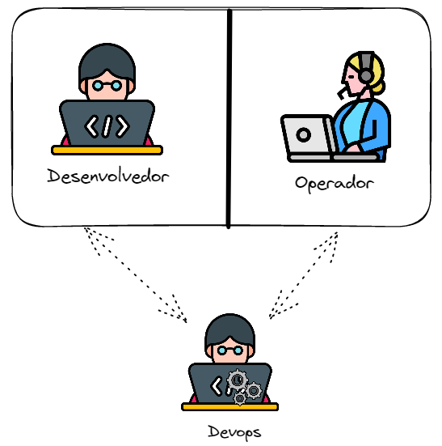
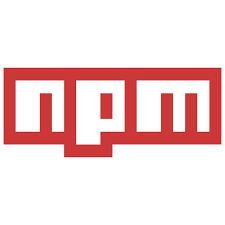
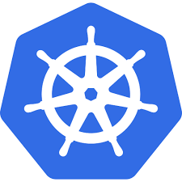
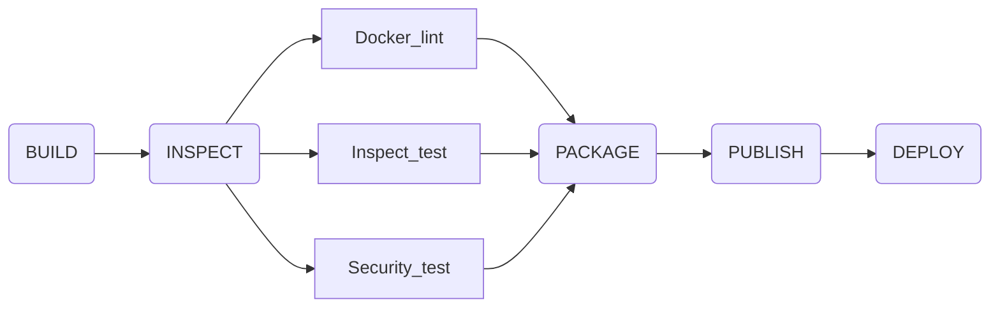
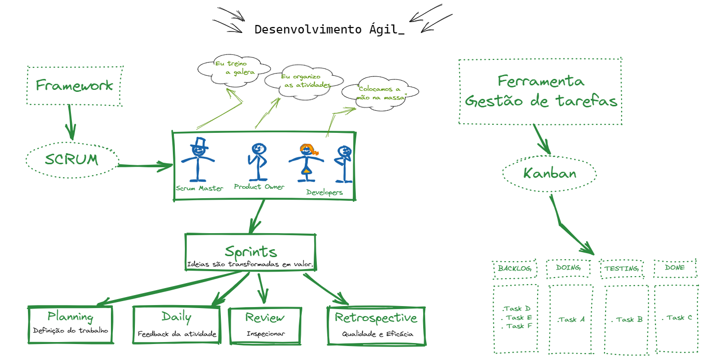

#  A cultura DevOps
Devops é conhecido como uma cultura pela qual as empresas utilizam práticas e ferramentas que ajudam a aumentar o desenvolvimento e entrega de software. 

Assim, desenvolvedores de softwares e operadores de infra estrutura trabalham em conjunto, ```compartilhando conhecimento```, colaborando e participando de todo o processo desde o início até o fim.
<br>

<center></center> 

Devops, é a junção das siglas **DEV**(desenvolvimento) e **OPS**(operação). 

⚠️ **Devops não é automação.**

---
## &#x1F44D; Benefícios ao se adotar a cultura Devops
- 🚀 **Velocidade de entrega**
    - Usa ferramentas para automatizar processos lentos e manuais.
- 🃏 **Escalabilidade**
    - A infraestrutura passa a ser gerenciada através de código(infrascode).
- 🧑‍🤝‍🧑 **Colaboração**
    - As duas equipes trabalham juntas para atingir o mesmo propósito.
- 👍 **Confiabilidade**
    - Automatização de testes de vários níveis durante todo o processo de desenvolvimento.
- 🔐 **Segurança**
    - Gerenciamento de configuração, políticas de segurança automática e controle de acessos.

## &#x1F4D6; Melhores práticas
Para garantir um nível de qualidade e evitar possíveis problemas durante o processo de construção de uma aplicação até o seu uso, é muito importante que o Engenheiro Devops, use as melhores práticas do mercado. 

A seguir, vamos entender quais são elas.

&#x1F4C3; **Infraestrutura como código**  
A infraestrutura é criada de forma programática e não mais de forma manual.
|✅ __Vantagens__|🛑 __Desvantagens__|
|:---|:---|
| - A equipe poderá compartilhar e reaproveitar o código;<br> - A infraestrutura passa a ser controlada através de um controle de versão;<br> - Os ambientes podem sofrer alterações de forma simultânea ou individual. | - Exigência de conhecimento quanto a alguma ferramenta de infrascode;<br>- FALTA TERMINAR...|

⚙️ **Arquitetura de microsserviços**  
Conjunto de pequenos serviços que juntos, representam um sistema.
|✅ __Vantagens__|🛑 __Desvantagens:__|
|:---|:---|
|- Cada serviço possui um única funcionalidade;<br> - Pode usar diferentes linguagens de programação;<br> - A implantação pode ocorrer de forma independentes dos demais.|- Exigência de conhecimento quanto a alguma ferramenta de infrascode;<br>- FALTA TERMINAR...|

📤 **Integração Contínua**  
Os testes são realizados sempre que o código é enviado para o repositório git central.
|✅ __Vantagens__|🛑 __Desvantagens:__|
|:---|:---|
|- Encontrar erros rapidamente a cada alteração do código;<br>- O tempo necessário de validação é reduzido;<br> - Ocorre de forma automática.|- Exigência de conhecimento quanto a alguma ferramenta de infrascode;<br>- FALTA TERMINAR...|

📦 **Entrega Contínua**  
Após a execução dos devidos testes, o software poderá ser "empacotado" e armazenado/implementado.
|✅ __Vantagens__|🛑 __Desvantagens:__|
|:---|:---|
|- Todo o processo de testes, empacotamento e entrega, são automatizados;<br>- Histórico e rastreamento através da ferramenta utilizada;<br>- Poderá ser adicionado a necessidade de autorização por um membro da equipe.|- Exigência de conhecimento quanto a alguma ferramenta de infrascode;<br>-FALTA TERMINAR...|
 
&#x1F4C9; **Monitoração**  
Observar o comportamento do ambiente e da aplicação.
|✅ __Vantagens__|🛑 __Desvantagens:__|
|:---|:---|
|- Observabilidade;<br>- Rastreamento;<br>- Gerar automações com base no comportamento da coleta de logs.|- Exigência de conhecimento quanto a alguma ferramenta de infrascode;- FALTA TERMINAR...|
 
&#x1F4E2; **Comunicação e colaboração**  
As equipes passam a trabalharem juntas com o objetivo de um bem comum.
|✅ __Vantagens__|🛑 __Desvantagens:__|
|:---|:---|
|- Definir normas culturais;<br>- Compartilhamento de experiências;<br>- Melhoramento contínuo no processo de trabalho.<br>|- Exigência de conhecimento quanto a alguma ferramenta de infrascode;<br>- FALTA TERMINAR...|

---
## &#x1F503; Estágios 
O desenho abaixo, lhe ajudará a entender de forma simples, os estágios de um processo Devops.

<center></center>

Para cada estágio, existem diversas ferramentas disponíveis para ajudar no processo como um todo.

---
## &#x1F6AB; &#x1F4B0; Segurança e Custos
Ao se utilizar da cultura devops para o desenvolvimento e implantação de software duas coisas importantes precisam ser levantadas, sendo elas:

- **Segurança:**
    - Segurança distribuída dentro da organização;
    - Prevenção e vulnerabilidades;
    - Softwares mais seguros e com qualidade;
    - Redução de custos para identificar e resolver problemas de segurança.

- **Custos:**
    - Licenças de softwares;
    - Recursos computacionais utilizados;
    - Outros
---
## &#x1F9F0; Ferramentas utilizadas
Atualmente(2023), as ferramentas descritas abaixo, são as mais utilizadas pelas empresas que seguem a cultura Devops.

|ESTÁGIO|FERRAMENTAS|DESCRIÇÃO|
|:---:|:---:|:---|
PLAN (planejamento)| <a href="https://miro.com/pt/"></a> <a href="https://excalidraw.com/"></a> | Plataforma visual colaborativa em formato de lousa online.
CODE (desenvolvimento)| <a href="https://git-scm.com/"></a> <a href="https://www.atlassian.com/software/confluence"></a> <a href="https://www.atlassian.com/software/jira"></a>| **_GIT_** - Controle de versionamento de código. _Confluence_ - Documentação. _Jira_ - Controle das atividades.
BUILD (construção)|<a href="https://www.maven.apache.org"></a>  <a href="https://www.npmjs.com/"></a>  | **_Maven_** - Utilizado para realizar o build de código Java. **_NPM_** - Utilizado para realizar o build de código NodeJS. 
Test (Testes)| <a href="https://junit.org/junit5/"></a> <a href="https://www.selenium.dev/"></a>| _JUnit_ - Ferramenta utilizada para a realizaçao de testes unitários. _Selenium_ - Ferramenta utilizada para a realização de telas/fluxos.
RELEASE (entrega)|<a href="https://www.jenkins.io"></a> <a href="https://www.gitlab.com"></a>| Ambas as ferramentas, são utilizadas para a criação de pipelines CI/CD. 
DEPLOY (implantação)| <a href="https://aws.amazon.com/pt/"></a> <a href="https://cloud.google.com/"></a> <a href="https://www.docker.com/"></a> | **_AWS e GCP_** - Provedores Cloud, que oferecem diversos recursos computacionais para a implantação de sistemas. **_Docker_** - Ferramenta que facilita a criação e administração de ambientes isolados. Ele possibilita o empacotamento de uma aplicação dentro de um contêiner, se tornando portátil para qualquer outro host que contenha o Docker instalado.
OPERATE (operação)| <a href="https://kubernetes.io/"></a>| Ferramenta de orquestração de contêineres.
MONITOR (monitoração)| <a href="https://www.zabbix.com/"></a> <a href="https://prometheus.io/"></a> <a href="https://www.splunk.com/"></a><a href="https://www.grafana.com"></a> | **_Zabbix_** - Monitoração da infraestrutura como: CPU, Memória, Disco, etc. **_Prometheus_** - Monitoração da aplicação como: métricas e alertas. **_Splunk_** - Realiza a observabilidade do ambiente. **_Grafana_** - Conecta nas demais ferramentas de monitoração, apresentando diversos dashboards pré-configurados.

---
##  Pipeline CI/CD
Todo o processo de construção, testes, empacotamento e implantação, é realizado através de uma pipeline CI/CD.
Quanto as siglas, temos:

- **CI - Continuos Integration**

    Integração Contínua, garante a qualidade do código-fonte em ambiente de constante mudança e diversas pessoas atuando ao mesmo tempo.

- **CD - Continuos Delivery**

    Entrega Contínua,  garante que uma mudança seja rapidamente entregue.

- **CD - Continuos Deployment**

    Implantação Contínua, garante que uma mudança seja rapidamente entregue.

**Exemplo de um modelo de pipeline completa:**


## 🚀 Metodologia

**SCRUM** 

Scrum é um framework que ajuda pessoas, times e organizações a gerar valor por meio de soluções adaptativas para problemas complexos.

 Scrum envolve grupos de pessoas que, coletivamente, possuem todas as
habilidades e conhecimentos necessários para fazer o trabalho e compartilhar ou adquirir essas
habilidades conforme necessário.



#### **Scrum TEAM**
Os membros possuem todas as
habilidades necessárias para criar valor a cada Sprint. Eles também são autogerenciáveis, o
que significa que decidem internamente quem faz o quê, quando e como. 

- **_Scrum Master:_** 

  Treinar os membros do time em autogerenciamento e cross-funcionalidade; 
  
  Concentrar na criação de incrementos de alto valor.

- **_Product Owner:_**

  Gerenciar o Product Backlog;

  Ordenar os itens do Backlog;

  Pode cancelar uma Sprint.

- **_Developers:_** 

  Cria plano para a Sprint Backlog;

  Definiçao de pronto;

  Colocar meta na Sprint.

#### **Sprint** 
Sprints são o coração do Scrum, onde ideias são transformadas em valor.
São eventos de duração fixa de um mês ou menos para criar consistência. Uma nova Sprint começa imediatamente após a conclusão da Sprint anterior.

 - **Planning**
   - Define o trabalho a ser realizado com base no backlog;
   - Reunião com duração máxima de 8 horas para sprint de um mês.
 - **Daily**
   - Duraçao de 15 minutos;
   - Falar o que foi feito ontem, o que será feito hoje e se tem algum impedimento.
 - **Review**
   - Inspecionar o resultado da Sprint;
   - Reunião com duração máxima de 4 horas para sprint de um mês.
 - **Retrospective**
   - Planejar maneiras de aumentar a qualidade e eficácia.
   - Reunião com duração máxima de 3 horas para sprint de um mês.

**KANBAN**

O Kanban consiste em uma ferramenta voltada a gestão de tarefas. Possui colunas que organizam as atividades de uma pessoa ou equipe. Enquadra-se no grupo das “metodologias ágeis”, que têm como principal objetivo a melhora da produtividade.

|TO DO (backlog)|DOING|TEST|DONE|
|:---           |:--- |:---|:---
|Atividade 1|Atividade 1||
|Atividade 2||Atividade 2|
|Atividade 3|||Atividade 3

## 📝  Descrição das atividades
É muito importante que você use uma linguagem simples e objetiva na descrição das atividades em que você estará atuando.

**Ao criar a task da atividade**
```
Eu como engenheiro devops, preciso criar uma imagem docker Maven. 

Os arquivos desse projeto, serão armazenados nesse repositório git: http://repo_git.dominio.com.br

Vou seguir essa documentação de referência: http://documentacao.com.br_
```

**Ao editar a task da atividade**
```
Criei a primeira versão do projeto que está na branch de dev.

Ainda falta configurar a integração com a ferramenta Sonar.

Preciso discutir algumas coisas com o @fabio e @maria

```

## ❓ Siglas
A tabela abaixo, lhe ajudará a entender o significado das siglas utilizadas na cultura Devops.


|SIGLA|SIGNIFICADO|
|:--|:--|
|SCM|Gerenciamento de ferramentas|
|DevSecOps|Trata-se da parte de segurança|
|FinOps|Trata-se da parte de custos|
|IOps|Trata-se da parte de custos|

## &#x1F517; Links de consulta
Abaixo, você poderá consultar os links de algumas documentações para o aprofundamento dos assuntos informados.

[Scrum](https://www.scrum.org/)
|
[Kanban](https://pt.wikipedia.org/wiki/Kanban)
|
[AWS Devops](https://aws.amazon.com/pt/devops/what-is-devops/)

##### [Menu principal](./README.md)
