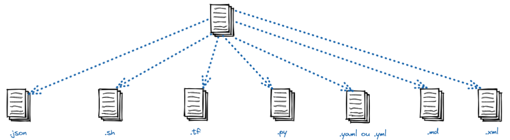

# 👷🏻 Devops Engineer
O Engenheiro Devops, é um pofissional de tecnologia no qual tem a função de ajudar desenvolvedores e analistas de infraestrutura, a gerenciar, automatizar e integrar ferramentas computacionais.

## Soft Skill

- Ter boa comunicação;
- Ser organizado;
- Ter auto gerenciamento;
- Ser Resiliênte e curioso;
- Não ter preguiça de aprender.

## Hard Skill

- Saber operar um Sistema Operacional;
- Criar imagens e gerenciar contêineres;
- Criar pipelines de CI/CD;
- Saber automatizar rotinas;
- Entender a leitura de algumas linguagens de programação;
- Conhecer um pouco de segurança.


**Saiba mais:**

[Devops Engineer](https://www.coursera.org/articles/devops-engineer)
## 📑 Arquivos mais utilizados
O Engenheiro Devops, precisará entender a sintaxe de alguns arquivos, que são utilizados em determinados processos de automação.



## Características de cada arquivo

**Arquivo JSON (JavaScript Object Notation)**

- Arquivo no formato chave:valor 

- Utilizado para passar informações de credenciais. 

- Tem a extensão .json

```json
{
   "cliente": {
       "id": 2020,
       "nome": "Maria Aparecida"
   },
   "pagamentos": [
       {
           "id": 123,
           "descricacao": "Compra do livro Cangaceiro JavaScript",
           "valor": 50.5
       },
       {
           "id": 124,
           "descricacao": "Mensalidade escolar",
           "valor": 1500
       }
   ]
}
```
**Saiba mais:**

[Arquivo JSON](https://www.alura.com.br/artigos/o-que-e-json)

**Arquivo SHELL (Shell Bash)**

 - Arquivo no formato bash; 

 - Utilizado para automação de rotinas. 

 - Tem a extensão .sh

```sh
#/bin/bash

# Comentário...

DATA: $(date)
echo $DATA
exit 0
```
**Saiba mais:**

[Bash](https://www.gnu.org/software/bash/manual/bash.html)

**Arquivo PYTHON (Linguagem de programação)**

 - Arquivo no formato bash; 

 - Utilizado para automação de rotinas. 

 - Tem a extensão .py

```py
ano = 2022
print (f'Olá {ano}')
```

**Saiba mais:**

[Documentação Python](https://www.python.org/)

**Arquivo HCL (HashiCorp Configuration Language)**

 - Arquivo que possui o formato declarativo; 

 - Utilizado para criar recursos computacionais em núvem. 

 - Tem a extensão .tf 

```c
resource "aws_instance" "ec2_instance"
ami           = xpto
instance_type = x1
subnet_id     = var.subnet_id
```
**Saiba mais:**

[Liguagem HCL](https://developer.hashicorp.com/terraform/language/syntax/configuration)

**Arquivo YAML/YML (Yet Another Markup Language)**

 - Arquivo estrutura no formato mapa ou lista; 

 - Utilizado por muitas ferramentas de gerenciamento de configuração, kubernetes, etc.

 - Tem a extensão .yml ou .yaml 

```yaml
image: docker:latest

variables:
  foo: bar

before_script
  - echo "Mensagem..."

script:
  - Docker login
  - Docker pull nginx:latest
  - Docker run -dit ... 
```
**Saiba mais:**

[Arquivo YAML:](https://www.redhat.com/pt-br/topics/automation/what-is-yaml)

***.md**

 - Arquivo no formato markdow; 

 - Utilizado para criar documentação do projeto. 

 - Tem a extensão .md ou .markdown 

```md
# Título

Tabela:
|CAMPO 1|DESCRICAO|
|:--  |:--
|Valor| Descrição


```
**Saiba mais:**

[Documentação Markdown](https://www.markdownguide.org/)

***.xml - eXtensible Markup Language**

 - É formado por um número ilimitado de TAGS; 

 - As TAGS são os rótulos da linguagem de marcação usadas para transmitir informação ao navegador; 

 - O início da estrutura de uma TAG é indicado pelo sinal de “<” e o final pelo sinal de “>”

```xml
<?xml version="1.0"?>
<PurchaseOrders xmlns="www.contoso.com">
  <PurchaseOrder
      PurchaseOrderNumber="99503"
      OrderDate="1999-10-20">
    <Address Type="Shipping">
      <Name>Ellen Adams</Name>
      <Street>123 Maple Street</Street>
      <City>Mill Valley</City>
      <State>CA</State>
      <Zip>10999</Zip>
      <Country>USA</Country>
    </Address>
 </PurchaseOrder>
</PurchaseOrders>
```
**Saiba mais:**

[Documentação XML](https://www.xml.com/)

## Entender os códigos do protocolo HTTP
É muito importante que você saiba entender o significado de alguns códigos de retorno, do protocolo HTTP. Isso te ajudará muito durante o processo de troubleshooting.

**Tabela de códigos HTTP**

|CÓDIGO|DESCRIÇÃO|
|:---:|:---      |
|200  | A requisição foi executada com sucesso |
|400  | A requisição não pôde ser compreendida pelo servidor|
|401  | Não autorizado. O servidor requer autenticação do cliente
|403  | A requisição foi compreendida pelo servidor, porém o mesmo se recusa a atender |
|404  | A requisição foi compreendida pelo servidor, porém o mesmo não encontrou o que foi solicitado 
|500  | O servidor encontrou uma condição inesperada que o impediu de atender à solicitação. 
|502  | O servidor recebeu uma resposta inválida do proxy ou gateway 
|503  | O servidor está sobrecarregado ou sofrendo alguma manutenção
|504  | O tempo de resposta na comunicação do servidor com outros serviços, foi excedido

**Saiba mais**

[Protocolo HTTP](https://developer.mozilla.org/pt-BR/docs/Web/HTTP/Basics_of_HTTP)
|
[Códigos HTTP](https://www.restapitutorial.com/httpstatuscodes.html)

## API - Application Programming Interface
sfsfsf


**Saiba mais**

[API](https://www.freecodecamp.org/news/what-does-api-stand-for-a-definition-of-the-coding-acronym-in-plain-english/)
|

##### [Menu principal](../README.md)
