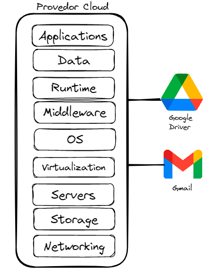
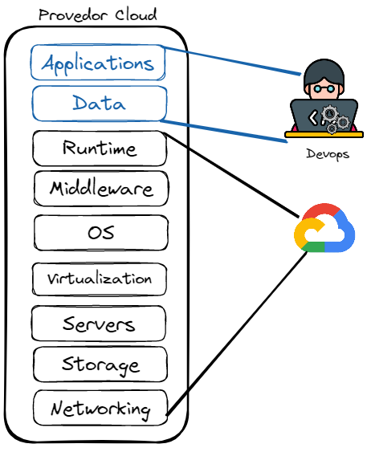
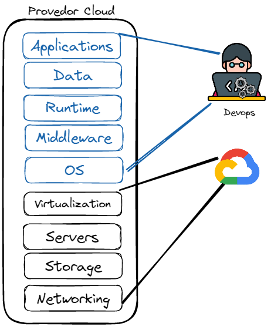
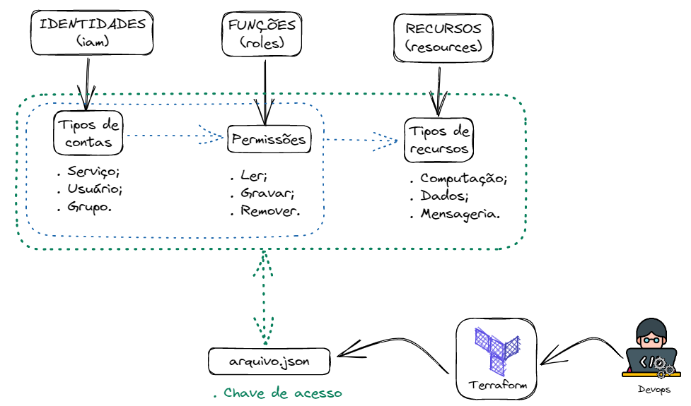

# 👷🏻 Competências Técnicas
O Engenheiro Devops, precisa dominar algumas ferramentas tecnológicas que juntas, através do processo de integração entre elas, todo o processo de desenvolvimento e entrega de softwares acabam sendo possível. 

Essas ferramentas podem ser organizadas como:
- Computação em Nuvem;
- Sistema Operacional;
- Infraestrutura como código;
- Conteinerização da aplicação;
- Monitoração da aplicação e infraestrutura;
- Automação de processos e rotinas.
---
## Computação em nuvem (Cloud Provider)
A computação em nuvem nada mas é que um conjuntos de serviços computacionais oferecidos para serem utilizados, conforme a necessidade da Empresa.

Esse recursos, são cobrados pelo seu tempo de uso e podem ser cancelados a qualquer momento.

### Tipos de nuvem
Temos três tipos de nuvem, sendo elas:

**Pública**  
 - Não tenho controle/privacidade dos dados. 
 - Infraestrutura é de responsabilidade do provedor. 
 - Mais fácil e barato pela implementação. 
 - Só paga o que usa.

**Privada**   
 - A infraestrutura não é compartilhada entre os clientes. 
 - Perde em custo e ganha em segurança.

**Híbrida** 
- Bastante utilizada. 
- Duas Cloud's que se interconectam. 
- Dados na privada e aplicação na pública. 

### Serviços oferecidos

|**SaaS - Software as a Service (EndUsers)**|**Características**|
|:---|:---|
|

 |- Executar um software, sem precisar instalar alguma coisa na máquina. - Serviço sobre demanda. - Os recursos são gerenciados pelo vendor(cloud provider)- Exemplo: Gmail, google drive, etc - Não precisa de licença e atualização de softwares.|

|**PaaS - Plataform as a Service (Desenvolvedores)**|**Características**|  
|:---|:---|
|

 |- S.O., linguagem de programação e banco de dados; - Infraestrutura de servidores e plataforma para os desenvolvedores trabalharem; - Flexibilidade para criar aplicação; - Não consegue mexer na infraestrutura.|        

|**IaaS - Infrastucture as a Service (Sysadmins)** |**Características**| 
|:---|:---|
|

 |- Criação de infraestrutura de datacenter - Balanceadores e afins - Acesso a tudo. - Não tem acesso a camada de virtualização.| 

### Tipos de recursos computacionais 
Todos os provedores cloud's praticamente oferencem os mesmo tipos de recursos computacionais, mudando apenas o nome comercial dado para tal recurso.

||<h1 align="center"></h1>|<h1 align="center"></h1>|<h1 align="center"></h1>
|---:|:---:|:---:|:---|
|**Banco de dados**|RDS|SQL|Microsoft Azure SQL Database

|**Armazenamento de arquivos**|S3|Cloud Storage|XPTO

|**Máquinas virtuais**|EC2|GCE|XPTO

⚠️ **_Por mais que a funcionalidade dos recursos oferecidos pelos provedores clouds, tenham as mesmas finalidades, a maneira de como operar eles são diferentes. Portanto, o Engenheiro Devops precisará estudar cada produto de forma separada conforme o provedor em que a empresa contratou._**

### Principais características
Ao se adotar um provedor cloud para criar toda uma determinada infraestutura computacional, o responsável por essa atividade que pode ser um Engenheiro de Cloud ou o próprio engenheiro Devops precisa entender como esses recursos computacionais se comunicam entre si. 

Isso é muito importante, pois muitos problemas ocorrem nessa etapa do processo e principalmente quando se usa uma ferramenta de provisionamento como o Terraform, Cloudformation, etc.

Esses recursos são integrados, conforme o desenho abaixo:

Roles

Policies

⚠️ **Computação em nuvem não é um data center.**

---
## Sistema Operacional (Linux)

---
## Sistema Operacional (Linux)
O principal Sistema Operacional utilizado pelos provedores Cloud é o Linux. Assim o Engenheiro Devops, precisará aprender a operar esse S.O. em alguns quesitos como:

- Saber trabalhar com o terminal de comandos;
- Manipular os arquivos;
- Gerenciar processos, programas e recursos de hardware;
- Rede;
- Logs.

---
## Infra estrutura como código (Infrascode)

### Sub-título

---
## Gerenciador de configuração (Config. Manager)

### Sub-título

---
## Conteinerização de aplicações (Container)

### Sub-título

---
## Monitoração (Observability)

### Sub-título

---
## Automação de rotinas (automation)

### Sub-título

##### [Menu principal](./README.md)
